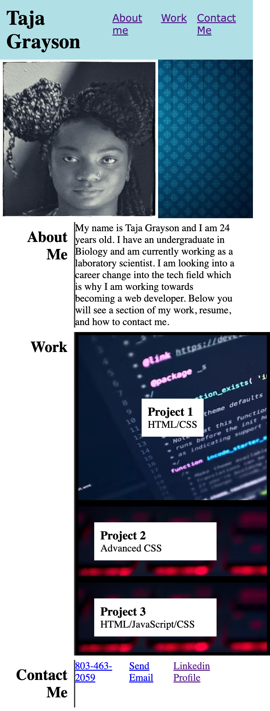

# Taja's Porftfolio

## Description

The motivation behind this project is my desire to break into the tech field and eventually be employed as a web developer. I built this project so that potential employers could take a look at my work and get to know me a bit so they can then determine if I am a good fit. This portfolio solves the problem of employers viewing my work, description of myself, and contact information in a less ideal way because now it is consolidated in one website. During this project I learned that it is perfectly fine to take a little creative freedom, meaning that my work does not need to look exactly like the example.

## Installation

N/A

## Usage 

To access my portfolio click this link: https://graysont3.github.io/2-Weekly-Challenge-Portfolio/ 

This is what the portfolio looks like: 

## Credits

Daniel Josef for the keyboard image  used for Project 2 & 3 sections.
Luca Bravo for the code image used for the Project 1 secttion.
Clipart Library for the background image under the header.

## License

Please refer to the license in Github